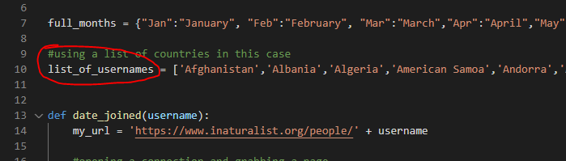
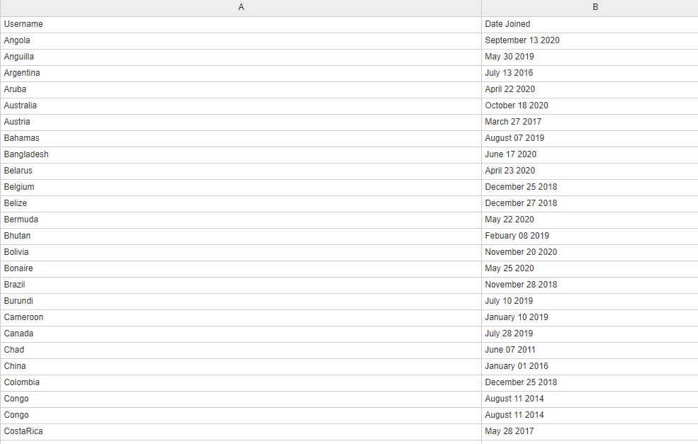
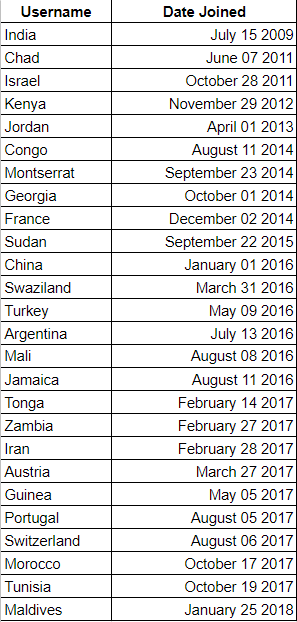
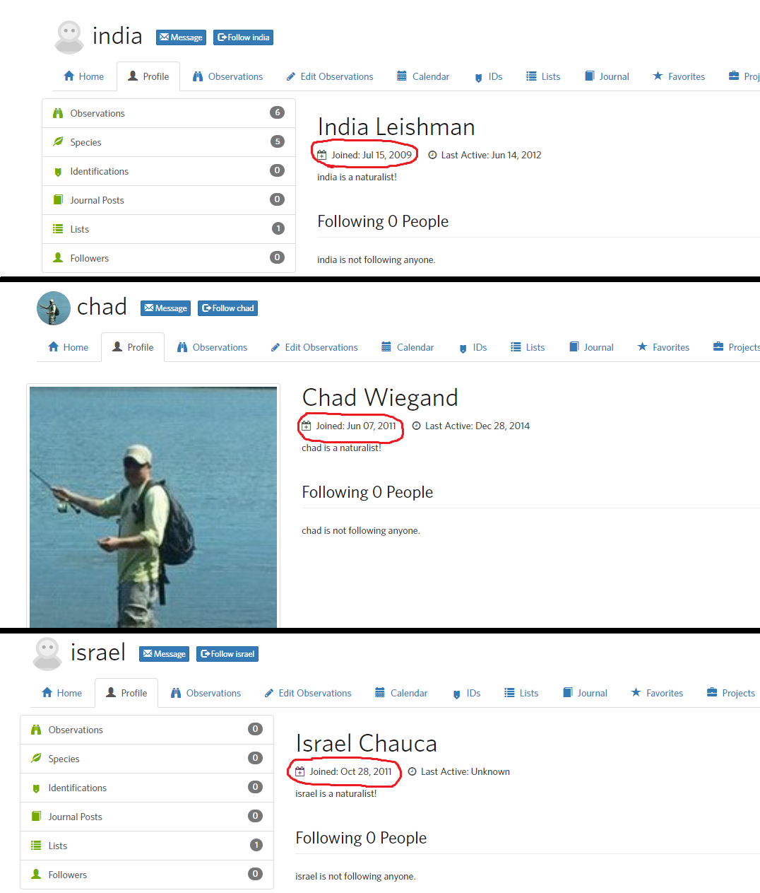

# iNaturalist_User_Data
I made a simple scraper that goes through a list of usernames and outputs a csv of the date the account was created

## Requirements
Make sure you have Python3.8 installed in your machine

## Installation
Clone this repo and type below command in your favorite command line terminal

```bash
pip install requirements.txt
```

## Usage
Run iNaturalist_Usernames.py through your console. It will run automatically and make a csv of the default list of usernames.
Change this list if you want it to go through your list instead:


The final .csv output will look like this (I added some of the formatting later):


## Random
The reason I did this code was because I wanted to see if there is a correlation between the population of a country and if a username is taken or not. At first I thought I proved my hypothesis that there is a correlation, because this was the list output, sorted by oldest to newest: 


However, on closer inspection, I realized that all the first few countries were just common names of people:


Another reason why the hypothesis was disproven was because Indonesia (the 4th most populous country), wasn't even on the top 30 of the oldest accounts, whereas small-population countries like Swaziland (rank 159 in terms of world population) was there.

## Contributing
Pull requests and feedback is welcome.
